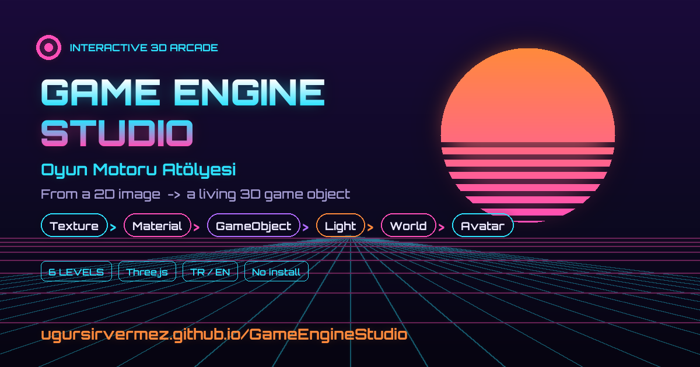
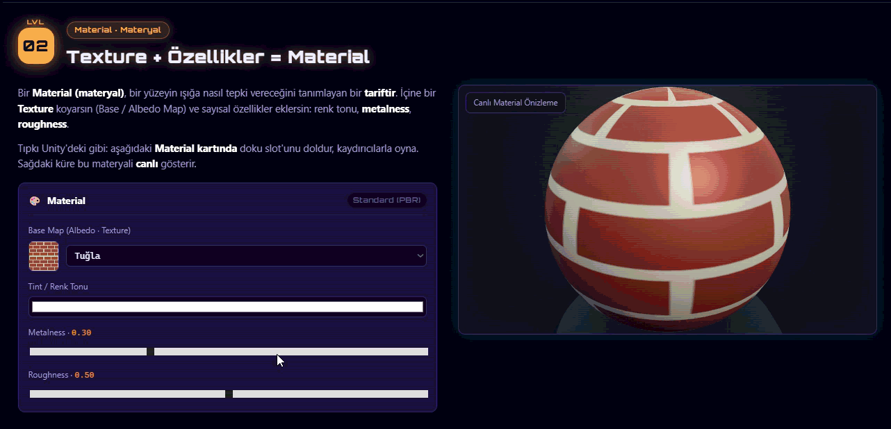
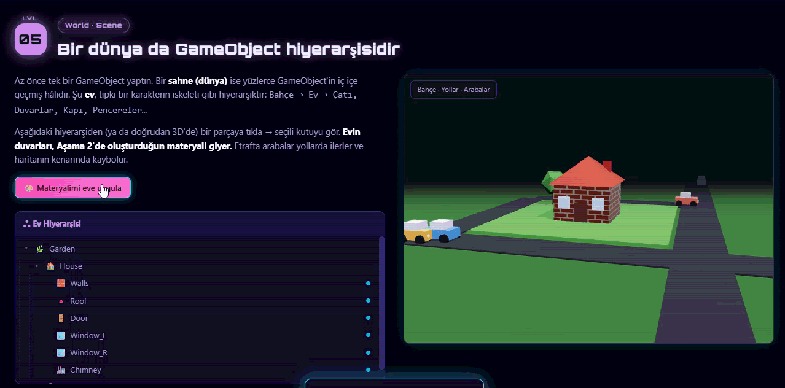

# 🎮 Game Engine Studio · Oyun Motoru Atölyesi

## 🔴 Open the studio → **<https://ugursirvermez.github.io/GameEngineStudio/>**

> **No install, no setup — just click the link above.** Works in any modern browser, on any device.
> Share this one link with your students and you're done.

## 🎬 A glimpse

**Build a GameObject — add a Mesh, then apply the Material you made:**

**A whole world is a GameObject hierarchy too — a house in a garden, with roads and passing cars:**

**The Avatar editor — explore the hierarchy, rig and animation:**

---

An interactive learning journey that goes **from a 2D image to a working 3D game object**.
It is built to help students *grasp by doing* the core game-engine concepts:
**Texture, Material, Mesh, GameObject, Lighting, Normal Map, Hierarchy, Rig and Animation**.

The page flows as a single, top-to-bottom **hierarchical** story — and each choice you make
carries over into the next stage:

| Stage | Topic | What you do |
|-------|-------|-------------|
| **01** | 📷 **Texture** | Pick a 2D pattern; see its flat (2D) form and how it **tiles** on a surface. |
| **02** | 🎨 **Material Studio** | *Just like Unity:* drop a Texture into a slot and add color / metalness / roughness to **build a Material**. Live 3D sphere preview. |
| **03** | 🧊 **GameObject Lab** | Empty GameObject → add a **Mesh** (shape) → apply the **Material** you built. Component list: Transform / Mesh Filter / Mesh Renderer. |
| **04** | 💡 **Light & Surface** | Move a light around a sphere and toggle a **normal map** — see how direction, **roughness** and fake bumps change the look, while the geometry never changes. |
| **05** | 🏠 **World / Scene** | A whole world is a GameObject hierarchy too: a **house** (`Garden → House → Roof, Walls, Door…`) wearing the material you built, in a garden with roads and **cars that drive off and vanish at the map edge**. |
| **06** | 🤖 **Avatar Editor** | Many GameObjects become a full avatar through **Hierarchy**, **Rig** and **Animation**. Click-select, edit, play. |

Every stage also has a **💻 Show Code** button (the real Three.js snippet, copyable) and a
**🎯 mini task**. Finish all six tasks and a **completion badge** lights up (tracked at the top right).

- 🌍 **Bilingual (TR / EN):** Opens automatically in the browser's language (Turkish if the
  browser is Turkish, English otherwise). You can also switch manually with the **TR / EN**
  button at the top right; your choice is remembered.

---

## 🎓 How to Use It in Class

Open the link, put it on the projector (or share it so students follow on their own devices),
and walk down the page:

| Stage | What to demonstrate |
|-------|---------------------|
| **01 · Texture** | Pick different patterns; show how the same image **tiles** across a surface. Point out that the chosen texture carries into the next stage. |
| **02 · Material** | Fill the texture slot, play with **Metalness / Roughness**; show the sphere updating live. Drive home: "Texture + properties = Material". |
| **03 · GameObject** | Run **1) Add Mesh → 2) Apply Material**. Show the component list (**Transform / Mesh Filter / Mesh Renderer**) filling up — same idea as the Unity Inspector. Toggle **Wireframe** to reveal the mesh. |
| **04 · Light & Surface** | Move the light; show the specular highlight sliding. Set **Roughness** low vs high (glossy vs matte). Toggle the **Normal Map** on, then **Wireframe** to prove the bumps are a lighting trick — geometry unchanged. |
| **05 · World / Scene** | Click parts of the **house** in the hierarchy (Roof, Walls, Door…) — same parent/child idea as a character rig, but for a building. Note the walls wear the material from Stage 2, and the cars drive off and vanish at the map edge. |
| **06 · Avatar** | Press **Next** to run the editor tour (Hierarchy → Mesh → Rig → Animation → Avatar). Rotate `Hips` (parent/child), turn on **Rig**, and play **Wave / Walk** to watch the animation drive the rig. |

> 💡 Tips: Open **💻 Show Code** on any stage to reveal the real Three.js behind it. Have students
> finish each **🎯 mini task** to fill the badge tracker. Switch to **EN** for international students.

---

## 📜 License

Released under the **MIT License** — free to use, share, and adapt (including in your own classes
and projects). See the [LICENSE](LICENSE) file for details.

**👉 Start here: <https://ugursirvermez.github.io/GameEngineStudio/>**
