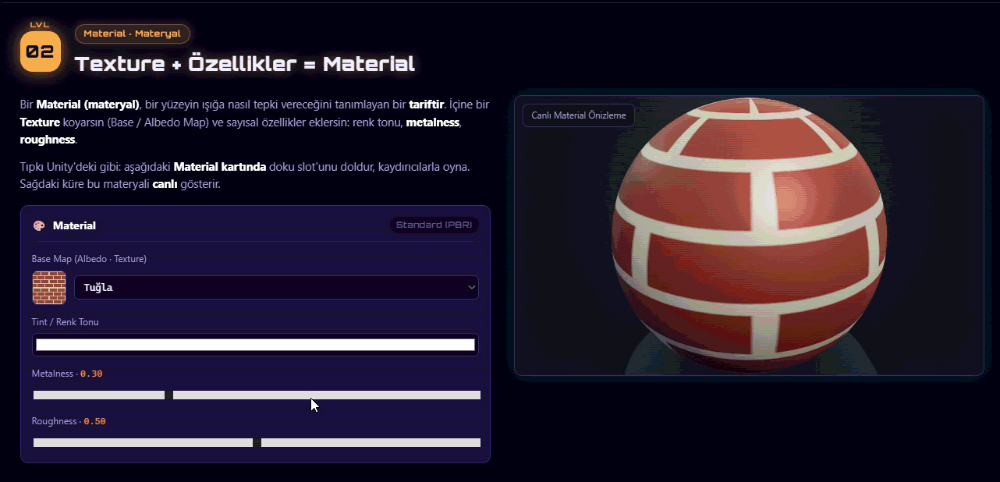
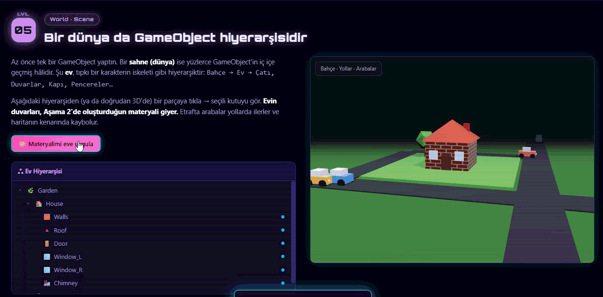

# Eğitimde Modelleme ve Tasarım

Eğitim Fakültesi · 2025–2026 Güz · Unity 6 ile 2B ve 3B paralel yürütülen 14 haftalık ders.

**Site:** <https://ugursirvermez.github.io/GameEngineStudio/>

| Sayfa | İçerik |
|---|---|
| [Giriş](https://ugursirvermez.github.io/GameEngineStudio/) | 1. hafta ders notu ve ders akışı: dersin amacı, model ve modelleme, oyun motorları, 2B ve 3B üretim, atölye gösterimi, dönem planı, değerlendirme, ikinci haftaya hazırlık. Eğitmen notları içerir; **Sunum görünümü** düğmesi notları gizler. |
| [Haftalık materyaller](https://ugursirvermez.github.io/GameEngineStudio/materyaller/) | 2–14. haftaların ders notları: kavramlar, 2B ve 3B uygulamaları, Unity 6 uyumlu örnek kodlar, ders içi uygulama, tekrar soruları, kaynaklar. |
| [Atölye](https://ugursirvermez.github.io/GameEngineStudio/atolye/) | Tarayıcıda çalışan, Three.js ile hazırlanmış altı aşamalı etkileşimli atölye: doku, materyal, GameObject, ışık ve yüzey, dünya, avatar. |

## Değerlendirme

| Bileşen | Oran | Zaman |
|---|---|---|
| Vize (uygulamalı sınav) | %40 | 8. hafta, bilgisayar başında, 90 dk |
| Final projesi | %60 | 14. hafta, sunum ve teslim |

Ölçüt tabloları giriş sayfasının 7. bölümünde.

## Atölyeden görüntüler





## Dosya yapısı

```
index.html          Giriş dersi (1. hafta)
materyaller/        2–14. hafta ders notları ve liste sayfası
atolye/             Etkileşimli Three.js atölyesi
css/site.css        Giriş ve materyal sayfalarının stili
js/site.js          Sunum görünümü ve içindekiler takibi
docs/               Ders planının Excel sürümü
```

Yerel önizleme için proje klasöründe:

```bash
python3 -m http.server 8000
```

## Lisans

MIT. Ayrıntı için [LICENSE](LICENSE).
